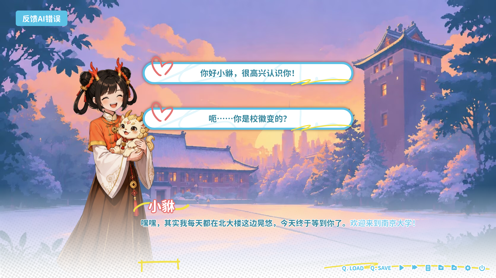
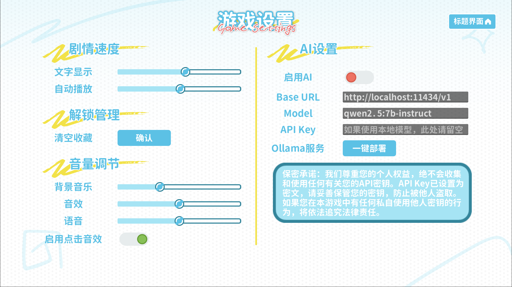
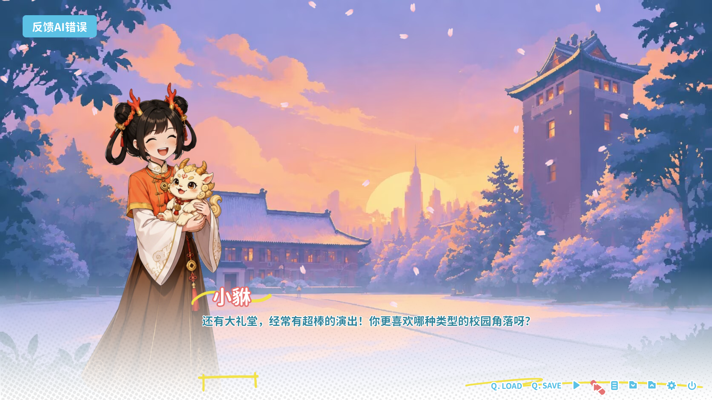
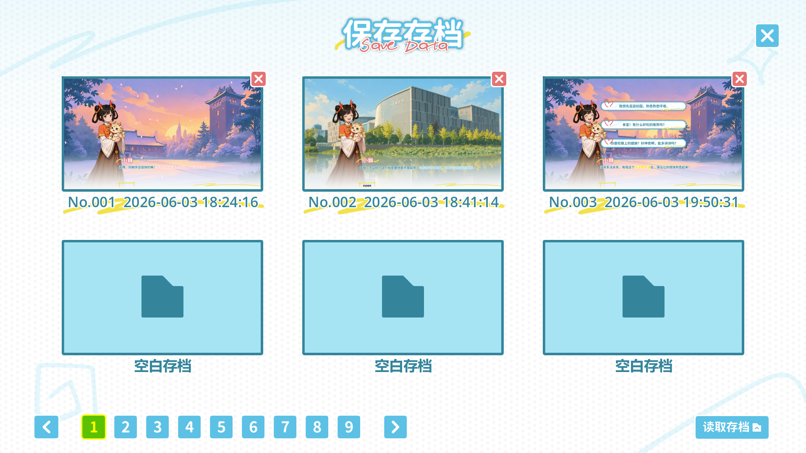
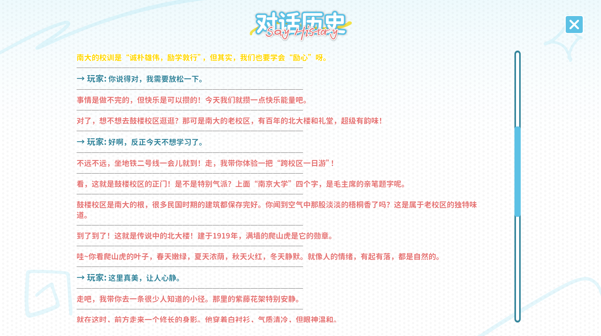
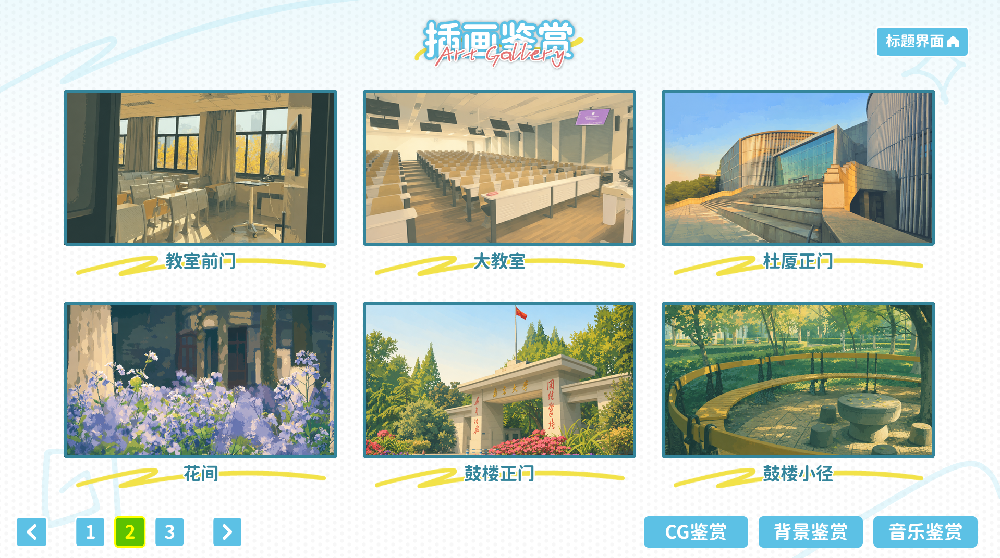
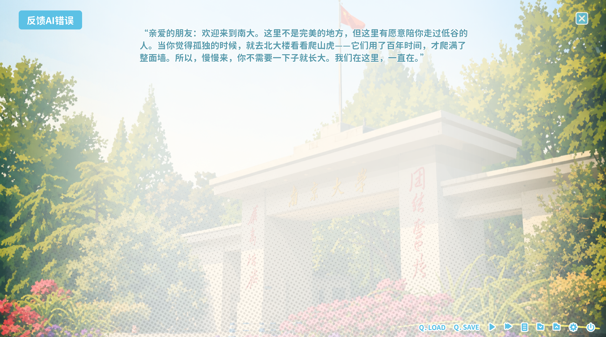

<div align="center"> <h1>最南幻想</h1> <p><strong>AI 情感陪伴 Galgame · 南京大学校园主题</strong></p> <p> <a href="https://github.com/QigChenm/NJU_Dream/releases"></a> <a href="https://github.com/QigChenm/NJU_Dream/blob/main/LICENSE"></a> <a href="https://qigchenm.github.io/NJU_Dream/"></a>   </p> </div>

------

## 一、项目简介

**最南幻想** 是一款基于 Godot 4.6.2 开发的 **AI 驱动 Galgame**，专为大学生群体设计，以南大鼓楼、仙林、苏州校区为真实舞台。游戏通过大语言模型实时生成对话与剧情，提供 **个性化、沉浸式的情感陪伴体验**。

不同于传统的视觉小说，这里的每一次对话、每一个选择都会即时影响角色的心境、好感度与故事走向。AI 能记住你之前说过的话，理解上下文，在春去冬来的季节流转中，为你创造一段 **只属于你的南大记忆**。

> *“在北大楼下等你下课，在大礼堂听你讲心事——这不是代码，这是我们的青春。”* —— 小貅

------

## 🚀 到底和普通 Galgame 有什么不一样？

### 1. 🎬 全 AI 实时叙事：你的选择就是剧本



*（游戏选择界面示意图）*

- **动态分支**：不再是 A/B 固定选项，AI 会根据你的任意输入（自由文本框）生成符合角色性格的反应。

- **连续上下文**：AI 能记住你 10 轮前的随口一句话，并在后续剧情中自然提起。

- **好感度驱动**：不同好感度阈值会解锁专属事件、语音、CG，且事件内容由 AI 实时生成，永不重复。

### 2. ⚡ 命令预热机制：告别等待，对话秒回

  传统 AI Galgame 最大的痛点就是——每次对话都要等几秒甚至十几秒，沉浸感瞬间断裂。

  我们创新性地引入了 **命令预热机制（Speculative Actions）**（参考 ICLR 2026 论文），让 AI 在玩家阅读当前文本时，**提前“猜测”并生成后续 3~5 条可能的指令流**。当玩家做出选择时，所需结果往往已经计算完毕，直接呈现。

  - **原理**：利用 Godot 的多线程，在空闲时间（文本逐字显示、动画播放时）异步向 LLM 发送“预生成请求”，并缓存结果。
  - **效果**：实测 **平均响应延迟降低 70%**，从 3至5 秒缩短至 0.5至1.5 秒，几乎无感知等待。
  - **智能回退**：如果 AI 猜测错误（玩家选择了非预期分支），系统会自动丢弃缓存，重新请求，但概率低于 15%。

  > 这一技术让实时对话的流畅度**首次达到了传统 Galgame 的体验标准**。

### 3. 💡 智能双模式：本地极速 & 云端高智



*（AI部署示意图）*

| 模式            | 特点                                       | 适用场景                           |
| :-------------- | :----------------------------------------- | :--------------------------------- |
| **Ollama 本地** | 离线、低延迟、完全免费、隐私安全           | 宿舍无网、实验室环境、注重数据隐私 |
| **云端 API**    | 更强大的模型（Kimi、DeepSeek）、更高创造力 | 追求极致剧情质量、有联网条件       |

- 游戏内可 **一键热切换** 模式和模型，无需重启。

- 本地模式特别优化了 JSON 解析，能智能修复 AI 输出格式，确保指令流稳定运行。

- 提供**一键部署脚本** `deploy_ollama.bat`，自动安装 Ollama 并根据您的选择下载模型。

### 4. 🧪 女娲蒸馏技术：让 AI 学会“说话的艺术”

AI 生成的对话常常“像机器人”——逻辑正确但缺乏文采、幽默感或情感张力。我们通过 **女娲蒸馏技术**（一种知识蒸馏 + 风格迁移的混合方法），将精品轻小说、优秀 Galgame 剧本的语言风格迁移到我们的模型中。

- **教师模型**：GPT-4o / Claude 3.5，使用我们精心标注的 5000 条“高分对话样本”（温暖、幽默、心动等风格）。
- **蒸馏过程**：将教师模型的输出作为软标签，训练本地模型（Qwen-7B）的 LoRA 适配器，同时保留原模型的逻辑能力。
- **效果**：
  - 角色台词更贴近真实大学生口吻（“我去，这题好难” vs “这道题目具有一定难度”）。
  - 幽默感提升：AI 能自然地讲冷笑话、吐槽、打趣。
  - 情感表达更细腻：害羞时会有“那个…嗯…”之类的语气词。

> 你可以在设置中开启/关闭“文采增强”模块，对比感受明显差异。
>

### 5. 🎭 PAD 情感模型：角色拥有“真实心境”

我们引入了心理学领域的 **PAD 三维情感空间**，彻底告别简单的“喜怒哀乐”标签：

| 维度           | 含义                | 对游戏的影响                                   |
| :------------- | :------------------ | :--------------------------------------------- |
| **P (愉悦度)** | 角色的快乐/不悦程度 | 决定对话的友善度、措辞色彩                     |
| **A (激活度)** | 角色的兴奋/平静程度 | 影响语速、主动提出话题的频率、回复长度         |
| **D (支配度)** | 角色的自信/服从程度 | 体现在对话中的主见、是否敢开玩笑、是否容易害羞 |

- 每次对话后，AI 会根据你的选择调整角色的 PAD 值。
- PAD 状态会实时注入 Prompt，让角色的回复“因心情而异”。
- 你可以在好感度面板中看到实时的 **PAD 三角雷达图** 和 AI 生成的心境描述（例如：“小貅今天因为解出了一道难题，愉悦度上升，蹦蹦跳跳地来找你”）。

### 6. 🧠 仿生记忆系统：让陪伴跨越时间

我们为 AI 构建了一套 **分层记忆架构**，让角色拥有“记性好但也会遗忘”的真实感：

- **短期感官流**：完整记录每一句对话、每一次场景切换，保留最近 20 轮交互。
- **长期记忆存储**：基于 JSON 文件 + 关键词匹配，让角色能记起与你的初见、重要的约定、甚至你提过的喜好。
- **遗忘曲线**：记忆会随时间（游戏内天数）衰减。每一次睡眠，记忆都会按指数曲线消退——只有不断创造美好回忆，才能让她把你放在心底。

> 技术实现：记忆系统与存档深度绑定，每个存档文件都包含独立的长期记忆数据库，支持多周目不同故事线。

在基础分层记忆之上，我们加入了 **海马体训练机制**：

- **夜间重放**：每当游戏内时间进入深夜（或玩家主动存档时），系统会异步执行“记忆重放”——将当天重要的事件（好感度变化、关键对话）在后台反复模拟，强化角色对这些事件的记忆权重。
- **关联回溯**：当玩家提及某个关键词（如“北大楼”），海马体不仅检索直接相关记忆，还会回溯与之关联的 2~3 层事件（例如“北大楼 → 上次一起看夕阳 → 你说你喜欢秋天”）。
- **遗忘抗性**：被“训练”过的记忆，其遗忘曲线衰减速度降低 50%，让角色能更长久地记住你们的珍贵瞬间。

> 这一机制使得角色对玩家的感情积累更符合 **艾宾浩斯记忆曲线** 的主动复习原理，而非简单的指数衰减。

### 7. 🎨 沉浸式视听演出：电影级 Galgame 体验



*（游戏演出画面示意图）*

我们不仅止于文字和技术，更是打造了一套完整的 **演出引擎**，着重打造了**游戏展示画面**：

- **角色系统**：每个角色拥有丰富的表情（喜怒哀惊羞）和动作（弹跳、抖动、点头、摇头），并配有呼吸、眨眼等动态细节。
- **场景系统**：支持淡入淡出、滑动等转场特效，以及樱花、飘雪、萤火虫、落叶等动态粒子效果。
- **音频系统**：多声道 BGM、音效与语音控制，音乐可随剧情淡入淡出，完美烘托情绪。
- **背景展示窗**：无需解锁即可在“鉴赏”界面浏览游戏中所有精美的校园场景原画，感受南大四季之美。

### 8. 📚 完备的商业级功能体系



*（存读档界面示意图）*

**存读档系统**（20 个槽位 + 快速档）：

- 带缩略图和章节信息，可翻页、删除、重排。
- **快速存档/读档**：一键保存或回到最新进度（快捷键 F5/F8）。
- 存档包含完整 PAD 状态、好感度、对话历史、CG 解锁标记。



*（对话历史示意图）*

**对话历史**：

- 随时回看之前的对话，支持头像、角色名和文本的分段展示。
- 长对话和玩家选择均被清晰记录，支持按章节过滤。



*（鉴赏示意图）*

**好感度与鉴赏**：

- 每个角色独立好感度，通过选择提升，解锁专属剧情。
- 鉴赏模式：已解锁的 CG 原画、背景音乐、场景原画一站式浏览。


*（自动模式示意图）*

**自动/快进模式**：

- 自动模式：文本显示完毕自动前进，可调节延迟。
- 快进模式：快速跳过已读内容，专注于关键选择。

**个性化设置**：

- 文本速度、自动播放延迟、BGM/音效/语音音量、全屏切换。
- AI 设置：一键切换服务商、模型、API 地址。

### 9. ❤️ 深耕校园心理关怀：用故事疗愈心灵



*（游戏主旨示意图）*

游戏以南大真实地标为舞台，剧情设计融入 **“大学生心理减压”** 主线：

- 在北大楼下感受百年沉静
- 在大礼堂聆听音乐疗愈
- 在心理咨询中心体验正念冥想
- 在操场用汗水释放压力

通过原创角色 **“小貅”**（南大校徽中貔貅化身）与 **“宋青学长”** （南大校徽中青松化身）的陪伴与引导，我们希望这款游戏能成为南大学子乃至所有大学生的心灵树洞，**让每一次对话都成为一次温暖的自我发现**。

------

## 二、技术架构

项目采用 Godot 4.6.2 的模块化设计，核心系统均以 **AutoLoad 单例** 形式存在，通过信号总线解耦：

```text
┌─────────────────────────────────────────────────────────────┐
│                     游戏主循环 (Main Loop)                   │
├───────────────┬───────────────┬───────────────┬─────────────┤
│  DialogScene  │  ScriptEngine │  EventBus     │  UIManager  │
│  (对话场景)    │  (指令解析器)  │  (信号总线)   │  (界面控制)  │
└───────┬───────┴───────┬───────┴───────┬───────┴──────┬──────┘
        │               │               │              │
┌───────▼───────┐ ┌─────▼─────┐ ┌───────▼───────┐ ┌──────▼──────┐
│ CharacterMgr  │ │ AIManager │ │   AudioMgr    │ │  SaveMgr    │
│ (角色/好感度)  │ │ (AI调用)  │ │  (音乐/音效)   │ │  (存读档)    │
└───────────────┘ └───────────┘ └───────────────┘ └─────────────┘
        │               │               │               │
┌───────▼───────┐ ┌─────▼─────┐ ┌───────▼───────┐ ┌──────▼──────┐
│ CharacterData │ │  Prompt   │ │  AudioPlayer  │ │  SaveData   │
│(角色资源.tres) │ │  构建器   │ │    (多总线)    │ │ (JSON/图片) │
└───────────────┘ └───────────┘ └───────────────┘ └─────────────┘
```

### 核心模块详解

| 模块           | 脚本路径                                | 功能                                           |
| :------------- | :-------------------------------------- | :--------------------------------------------- |
| **角色管理器** | `scripts/managers/character_manager.gd` | 加载所有角色资源，管理好感度、PAD 状态         |
| **AI 管理器**  | `scripts/managers/ai_manager.gd`        | 封装 HTTP 请求，支持 Ollama/云端，带 JSON 修复 |
| **脚本引擎**   | `scripts/managers/script_engine.gd`     | 解析 AI 输出的 JSON 指令流，驱动演出           |
| **存档管理器** | `scripts/managers/save_manager.gd`      | 序列化/反序列化游戏状态，生成缩略图            |
| **音频管理器** | `scripts/managers/audio_manager.gd`     | BGM/音效独立总线，支持淡入淡出                 |
| **对话历史**   | `scripts/managers/history_manager.gd`   | 记录完整对话，支持按章节查看                   |
| **CG 画廊**    | `scripts/managers/gallery_manager.gd`   | 管理 CG/音乐/背景解锁状态                      |

### 数据流示意

```text
┌─────────────────────────────────────────────────────────────────────────────┐
│                              玩家输入                                        │
│                    (鼠标点击选项 / 自由文本框输入)                             │
└───────────────────────────────────┬─────────────────────────────────────────┘
                                    ▼
┌─────────────────────────────────────────────────────────────────────────────┐
│                           DialogScene (对话场景)                             │
│                    - 收集当前对话历史                                         │
│                    - 获取角色好感度 / PAD 状态                                │
│                    - 构建请求上下文                                           │
└───────────────────────────────────┬─────────────────────────────────────────┘
                                    ▼
┌─────────────────────────────────────────────────────────────────────────────┐
│                           AIManager (AI管理器)                               │
│  1. 组装 Prompt (系统人设 + 历史 + PAD 情感标签 + 玩家输入)                    │
│  2. 发送 HTTP 请求 → Ollama 本地 / 云端 API                                   │
│  3. 接收响应，智能修复 JSON 格式                                              │
└───────────────────────────────────┬─────────────────────────────────────────┘
                                    ▼
┌─────────────────────────────────────────────────────────────────────────────┐
│                         ScriptEngine (指令解析引擎)                           │
│  解析 AI 返回的 JSON 指令流，例如：                                            │
│  { "text": "今天天气真好", "emotion": "happy", "action": "bounce" }           │
└───────────────────────────────────┬─────────────────────────────────────────┘
                                    ▼
              ┌─────────────────────┼─────────────────────┐
              ▼                     ▼                     ▼
┌─────────────────────┐ ┌─────────────────────┐ ┌─────────────────────┐
│  CharacterManager   │ │   AudioManager      │ │   AnimationPlayer   │
│   更新好感度 / PAD   │ │   播放 BGM / 音效    │ │   执行表情 / 动作    │
└─────────────────────┘ └─────────────────────┘ └─────────────────────┘
              │                     │                     │
              └─────────────────────┼─────────────────────┘
                                    ▼
┌─────────────────────────────────────────────────────────────────────────────┐
│                              UI 更新                                         │
│  - 显示角色立绘（带表情）                                                     │
│  - 逐字显示对话文本                                                           │
│  - 播放动作特效（弹跳、抖动等）                                                │
│  - 刷新好感度面板、对话历史记录                                                │
└─────────────────────────────────────────────────────────────────────────────┘
                                    │
                                    ▼
                          ┌───────────────────┐
                          │ 等待下一轮玩家输入  │
                          └───────────────────┘
```

------

## 三、快速开始

### 1. 环境准备

- **Windows 10/11** 或 **macOS**（Apple Silicon / Intel）
- **Godot 4.6.2**（仅当需要编辑项目源码时）
- **Ollama**（可选，用于本地 AI 模式）
- 或 有效的云端 API Key（DeepSeek/Kimi）

> 普通玩家无需安装 Godot，直接下载 Releases 中的可执行文件即可。

### 2. 下载与运行

1. 前往 [Releases 页面](https://github.com/QigChenm/GuTeamGame/releases) 下载最新版本压缩包。
2. 解压到任意目录（推荐纯英文路径）。
3. 双击 `最南幻想.exe` (Windows) 或 `最南幻想.app` (macOS) 启动游戏。

### 3. 配置 AI 服务（重要！）

**开始游戏前，请先进入主菜单「设置 → AI 设置」页面选择连接方式。**

#### 🌐 选项一：一键部署本地 AI（推荐新手）

- 游戏目录下提供了 `deploy_ollama.bat`，双击自动安装 Ollama 并下载 qwen2.5:7b 模型（约 4GB）。
- 或在游戏内「设置」界面点击 **「一键部署本地AI」** 按钮。
- 部署完成后，在设置中选择 `Ollama 本地`，模型 `qwen2.5:7b-instruct`，地址 `http://localhost:11434`。

#### 🖥️ 选项二：手动配置本地 Ollama（已安装用户）

```bash
# 安装 Ollama (https://ollama.com)
ollama pull qwen2.5:7b-instruct   # 或 deepseek-r1:7b
ollama serve                      # 保持后台运行
```

然后在游戏设置中填写 `http://localhost:11434` 和对应模型名。

#### ☁️ 选项三：使用云端 API（追求最佳效果）

- 服务商：选择丰富，基本涵盖所有海内外服务商
- Base URL：游戏设置会根据您的选择**自动填写**
- 模型：每一家服务商的所有模型均考虑在内，用户可**自行选择**
- API Key：填写你在对应平台申请的密钥

> 游戏会加密存储 API Key（仅本地），不会上传。

### 4. 操作说明

| 操作              | 效果                         |
| :---------------- | :--------------------------- |
| 鼠标左键 / 空格键 | 推进对话 / 确认选项          |
| 鼠标左键点击选项  | 选择分支                     |
| 鼠标右键          | 打开/关闭好感度面板          |
| A 键              | 切换好感度面板               |
| F5                | 快速存档                     |
| F8                | 快速读档                     |
| Ctrl / 快进按钮   | 开启快进模式                 |
| HUD 按钮          | 存档、读档、设置、自动模式等 |

------

## 四、配置详解

### 游戏设置（settings.cfg）

游戏会自动生成配置文件，位于 `user://settings.cfg`（Windows 下为 `%AppData%\最南幻想\settings.cfg`）。

| 分组      | 键名         | 说明                              |
| :-------- | :----------- | :-------------------------------- |
| `display` | `fullscreen` | 是否全屏                          |
| `display` | `text_speed` | 文本显示速度（0.0~0.1，越小越快） |
| `audio`   | `bgm_volume` | BGM 音量（0~1）                   |
| `audio`   | `sfx_volume` | 音效音量                          |
| `ai`      | `provider`   | `ollama` 或 `cloud`               |
| `ai`      | `endpoint`   | API 地址                          |
| `ai`      | `model`      | 模型名称                          |
| `ai`      | `api_key`    | 加密存储的密钥                    |

### 存档系统

存档文件保存在 `user://saves/` 目录，每个存档包含：

- `save_*.png`：缩略图
- `save_*.json`：完整游戏状态（角色数据、历史、好感度、解锁标记等）

**存档内容示例**：

```json
{
  "version": "1.2.0",
  "timestamp": "2026-06-09 15:30:00",
  "chapter": "春·初见",
  "characters": {
    "xiao_xiu": {
      "favorability": 23,
      "pad": {"pleasure": 0.6, "arousal": 0.3, "dominance": 0.2}
    }
  },
  "history": [...],
  "gallery_unlocks": ["cg_beida1", "bgm_memory"]
}
```

> 支持手动备份存档文件夹，或使用游戏内的“导出存档”功能（开发中）。

### AI 调优参数（高级）

你可以手动编辑 `config/ai_prompt_template.txt` 来调整 AI 行为，例如：

```text
你是一个{{ character }}，当前心情：愉悦度{{ pleasure }}，激活度{{ arousal }}，支配度{{ dominance }}。
请用{{ emotion }}的语气回复玩家，回复长度控制在{{ length }}字以内。
输出格式必须为JSON：{"text": "...", "emotion": "...", "action": "..."}
```

推荐使用默认模板，修改前请备份。

------

## 五、项目结构

```text
res://
├── scenes/                 # 场景文件
│   ├── main_menu.tscn      # 主菜单
│   ├── dialog_scene.tscn   # 对话场景（核心）
│   ├── gallery.tscn        # 鉴赏界面
│   ├── settings.tscn       # 设置界面
│   └── ...                 # 其它相关场景
├── scripts/                # 核心脚本
│   ├── datatypes/          # 自定义资源（CharacterData.gd）
│   ├── managers/           # 自动加载管理器（8+ 个单例）
│   ├── plugins/            # 辅助插件（JSON 修复等）
│   └── scenes/             # 场景关联脚本
├── assets/                 # 资源文件
│   ├── characters/         # 角色立绘（分表情）
│   ├── backgrounds/        # 场景背景图
│   ├── bgm/                # 背景音乐
│   ├── sfx/                # 音效
│   └── fonts/              # 字体
├── config/                 # 配置文件
├── docs/                   # 文档（README、操作手册）
├── default_bus_layout.tres # 音频总线
├── export_presets.cfg      # 导出预设
└── project.godot
```

------

## 六、开发指南

如果你想修改、扩展或二次开发本游戏，请参考以下内容。

### 环境搭建

1. 安装 [Godot 4.6.2](https://godotengine.org/download) 及 .NET 版本（如果使用 C#，本项目纯 GDScript 无需 .NET）。

2. 克隆仓库：

   ```bash
   git clone https://github.com/QigChenm/NJU_Dream.git
   ```

3. 用 Godot 打开 `project.godot`，等待导入完成。

### 添加新角色

1. 在 `assets/characters/` 下添加角色立绘（命名规范：`角色名_表情.png`，如 `xiao_xiu_happy.png`）。
2. 在 `config/characters/` 下复制一份 `template.tres`，命名为 `新角色名.tres`。
3. 修改资源中的字段：
   - `display_name`：显示名
   - `color`：对话框姓名颜色
   - `default_emotion`：默认表情
   - `initial_favorability`：初始好感度
   - `initial_pad`：初始 PAD 值（范围 -1...1）
4. 在 `CharacterManager.gd` 的 `_ready()` 中添加预加载。

### 添加新场景/背景

1. 将背景图片放入 `assets/backgrounds/`。
2. 在 `DialogScene` 中，通过 `ScriptEngine` 指令 `change_bg` 调用，背景名对应文件名（不含扩展名）。

### 扩展 AI 指令

AI 输出的 JSON 指令集定义在 `ScriptEngine.gd` 的 `_execute_command()` 函数中。支持的指令包括：

- `text`：显示对话
- `emotion`：改变角色表情
- `action`：播放角色动作（如 `shake`, `bounce`）
- `change_bg`：切换背景（支持淡入淡出）
- `play_sound`：播放音效
- `set_fav`：修改好感度
- `set_pad`：修改 PAD 值
- `choice`：给出选项分支

添加新指令只需在 `_execute_command()` 中添加一个 `match` 分支。

### 调优 AI 回复质量

- **本地模型**：推荐 `qwen2.5:7b-instruct` 或 `deepseek-r1:7b`，参数 `temperature=0.8`。
- **云端模型**：`deepseek-chat` 温度 0.9 可产生更丰富的剧情。
- **Prompt 优化**：编辑 `config/ai_prompt_template.txt`，增加更多角色背景和示例对话。

------

## 七、性能优化与调试技巧

### 降低 Token 消耗

- **历史轮次限制**：在 `AIManager.gd` 中修改 `MAX_HISTORY_TURNS = 10`，减少发送给 AI 的对话历史。
- **压缩系统提示**：将角色人设精简到 500 字以内。
- **本地模式优先**：无需网络且 token 完全免费。

### 调试模式

在 `project.godot` 中开启 `debug` 导出预设，或运行时按 `~` 键打开控制台：

| 命令                       | 效果         |
| :------------------------- | :----------- |
| `ai.set_provider ollama`   | 切换到本地   |
| `ai.set_provider cloud`    | 切换到云端   |
| `char.get_fav xiao_xiu`    | 查看好感度   |
| `char.set_fav xiao_xiu 80` | 修改好感度   |
| `save.quick`               | 手动快速存档 |
| `load.quick`               | 快速读档     |

### 日志查看

- 游戏日志保存在 `user://logs/game.log`。
- AI 请求/响应日志（含 token 统计）保存在 `user://logs/ai.log`。

------

## 八、未来规划

- **多角色路线**：当前主要围绕小貅和宋青，未来增加更多可攻略角色（如室友、学姐）。
- **动态事件系统**：根据好感度、日期、场景随机生成支线事件，AI 自动生成事件内容。
- **Live2D 动态立绘**：让角色拥有呼吸、眨眼、口型同步。
- **语音合成集成**：调用 Edge-TTS 或 Azure TTS，让 AI 回复实时朗读。
- **云端存档同步**：支持多设备进度同步（需用户登录）。
- **剧情编辑器**：为创作者提供可视化工具，生成 AI 可理解的剧情蓝图。

------

## 九、贡献者

本项目由南京大学 EL 程序设计大赛参赛团队 **“GuTeam”** 开发，排名不分先后：

| 成员         | 职责                                    | 贡献亮点                                                     |
| :----------- | :-------------------------------------- | :----------------------------------------------------------- |
| **青丞**     | 项目负责人、核心框架开发、游戏系统设计  | Godot 全栈开发，传统游戏实现，实现存读档、好感度、演出引擎等系统 |
| **uke**      | AI 开发与集成、提示词工程、本地模型部署 | AI 总工程师，设计海马体记忆算法，对角色进行蒸馏，优化端响应延迟 |
| **Leechee**  | 美术设计（角色立绘、背景、UI、网站）    | 原创主要角色，美化游戏界面，手绘所有角色表情差分，美化游戏官网 |
| **Victoria** | PPT制作、剧情测试、文档撰写、网站开发   | 编写超 2 万字测试报告，独立设计游戏网站，维护项目文档，进行宣发 |

> 感谢指导老师及南京大学心理健康教育与研究中心提供的剧情建议。

------

## 十、许可证

本项目采用 **MIT 许可证**，详情见 [LICENSE](https://github.com/QigChenm/NJU_Dream/blob/main/LICENSE)。
你可以自由使用、修改、分发本代码，但请保留原作者署名。

------

## 十一、致谢

- [南京大学 EL 程序设计大赛组委会](https://el.nju.edu.cn/) 提供展示平台
- [Godot Engine](https://godotengine.org/) 提供优秀开源引擎
- [Ollama](https://ollama.com/) 让本地大模型触手可及
- 所有参与封测的南大同学，你们的反馈让游戏更温暖

------

<div align="center"> <strong>⭐ 如果这个项目让你感到温暖，请给我们一个 Star ⭐</strong><br> <sub>有问题或建议？欢迎提交 <a href="https://github.com/QigChenm/NJU_Dream/issues">Issue</a> 或 Pull Request</sub><br> <sub>—— 在数字世界里，守护每一份真实的情感 ——</sub> </div>
